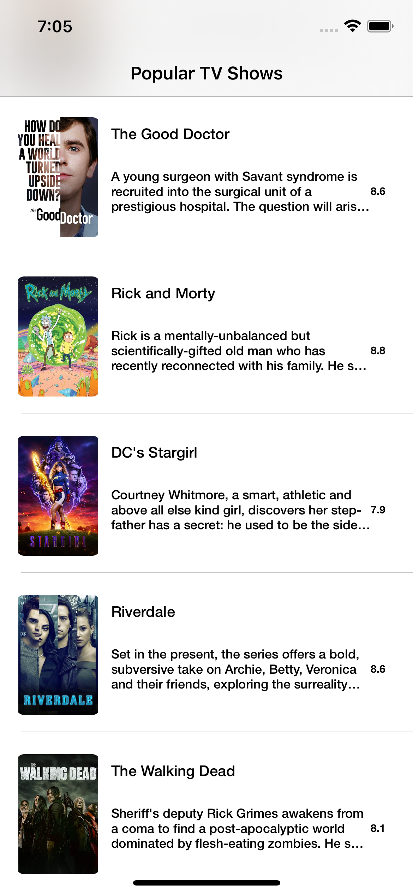
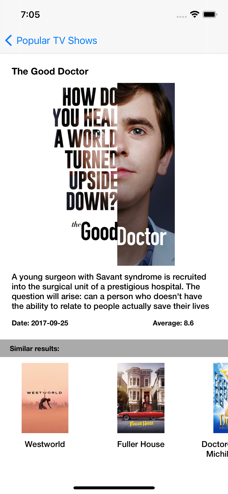
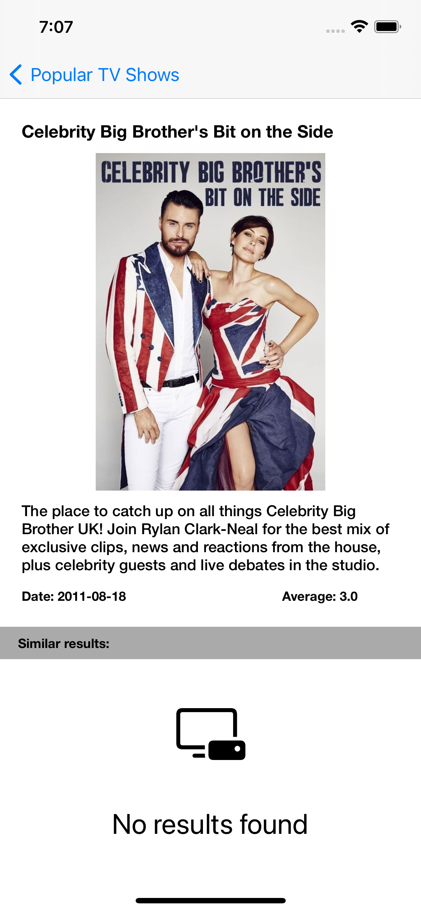

# ChallengeMedicato

## Description

This repository contains the solution of the movie app implemented for the iOS Challenge of Medicato

### Navigation flow

The app has the following navigation flow:
- Popular TV Shows
- Similar TV Shows

### Specification of the API

#### Popular TV Shows
URL:  https://api.themoviedb.org/3/tv/popular

Parameters:
  - api_key
  
  #### Similar TV Shows
  URL:  https://api.themoviedb.org/3/tv/{id_popular}/similar

  Parameters:
  - api_key
  - id_popular

#### Download Image
URL:  https://image.tmdb.org/t/p/w500/

Parameters:
- path_image

## Requirements
- Xcode 11.5
- Cocoapods
- Minimum iOS Target 14.5

## Implementation

### Architecture

The software design was based in Interaction Driven Design (IDD). This approuch helps focus on modelling behaviour according to the external usage of the system. 
The project has three folders that describes the layers of the architecture.
Delivery, Domain (Core in the project) and Infraestructure. The Delivery layer was implemented using VIPER.

### ChallengeMedicato
This is the main application. 
The project has the following dependencies
- KIF
- Kingfisher
- MBProgressHUD

> Important!
> The snapshots was saved using the iPhone 12 Pro device.

### Screens

#### Popular TV Shows

  

#### Similar TV Shows

  

#### Not Result Similar TV Shows

  

